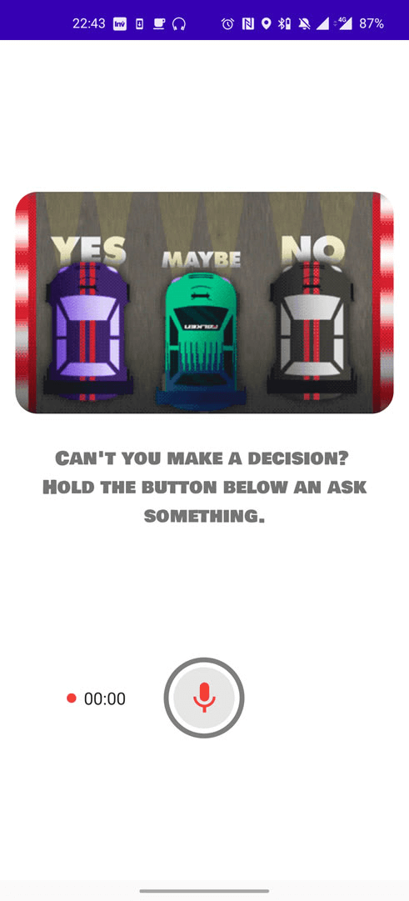
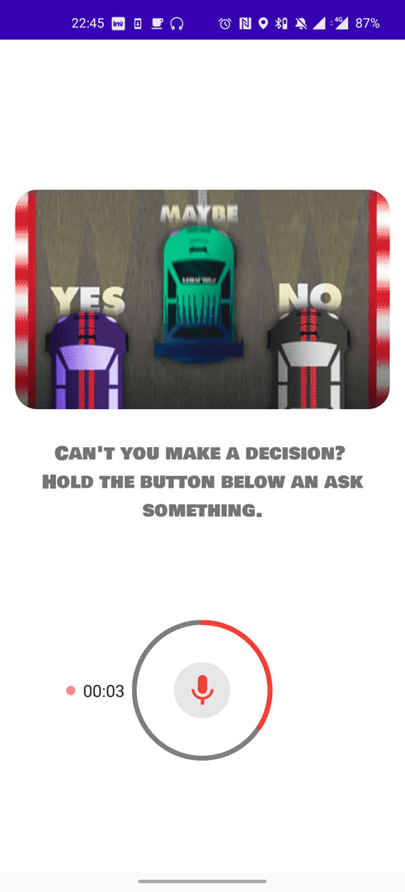
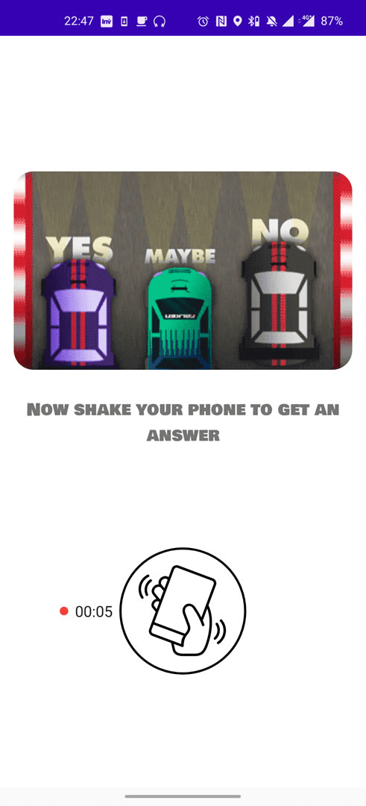
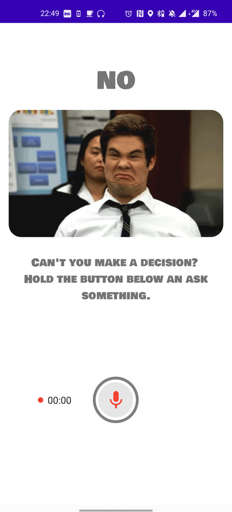
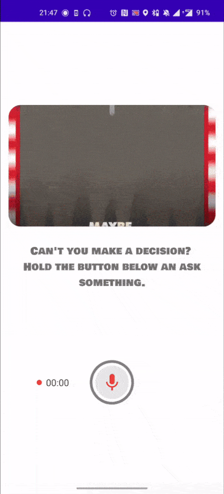

# YesOrNo
### This is an example project using

  - MVI architecture
  - Hilt dependency injection
  - Coroutine, Flow
  - Retrofit
  - api https://yesno.wtf/

</img>
</img>
</img>
</img>
</img>
</img>
